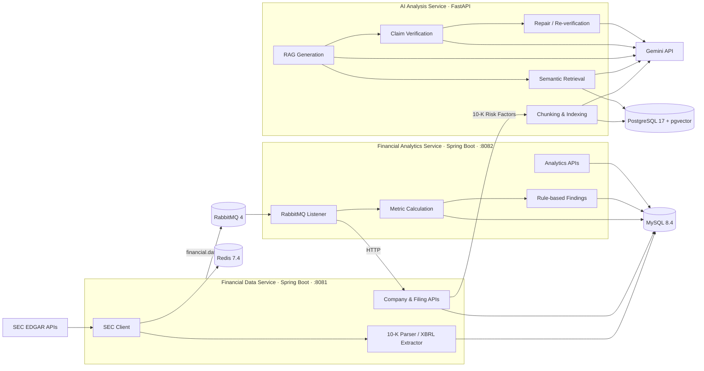

from pathlib import Path

readme = r"""# FinIntel

**An event-driven financial intelligence platform for ingesting SEC filings, calculating financial metrics, detecting financial signals, and answering evidence-grounded questions over 10-K disclosures.**

FinIntel combines a Java/Spring Boot backend with a Python/FastAPI retrieval-augmented generation (RAG) service. Public-company data is collected from SEC EDGAR, normalized into reusable financial records, propagated asynchronously for downstream analytics, and indexed into PostgreSQL/pgvector for semantic retrieval and evidence-grounded AI analysis.

---

## Architecture



---

## Services

| Service | Stack | Responsibility | Port |
|---|---|---|---:|
| `financial-data-service` | Java 21, Spring Boot, JPA, MySQL, Redis, RabbitMQ | SEC ingestion, company data, financial statements, 10-K retrieval/parsing | `8081` |
| `financial-analytics-service` | Java 21, Spring Boot, JPA, MySQL, RabbitMQ | Financial metrics, growth indicators, rule-based financial findings | `8082` |
| `ai-analysis-service` | Python, FastAPI, Gemini, PostgreSQL/pgvector | Embeddings, SEC document indexing, semantic retrieval, RAG, verification and repair | local FastAPI runtime |

Infrastructure is defined under `infra/docker-compose.yml`.

---

## 1. Financial Data Service

The data service is the ingestion and normalization layer of FinIntel.

### SEC integration

It integrates with SEC EDGAR endpoints for:

- company ticker mappings
- Company Facts / XBRL data
- company submissions
- filing documents

The service resolves ticker-to-CIK mappings, retrieves multi-year financial facts, identifies the latest 10-K, downloads filing HTML, extracts readable text, and isolates the `Item 1A. Risk Factors` section.

### Redis caching

SEC responses are cached to reduce repeated external requests:

| Data | Cache TTL |
|---|---:|
| Company ticker mapping | 24 hours |
| Company Facts | 6 hours |
| Company submissions | 6 hours |
| Filing documents | 24 hours |

### Financial statement extraction

The XBRL extractor builds annual statements containing fields such as:

- revenue
- gross profit
- operating income
- net income
- total assets and liabilities
- debt
- cash and cash equivalents
- inventory
- accounts receivable
- current assets and liabilities
- operating cash flow
- capital expenditure

Revenue concepts include fallbacks across common US-GAAP tags, and annual facts are filtered to fiscal-year `10-K` / `10-K/A` filings.

### Persistence and event publication

Normalized company and financial-statement records are stored in MySQL with Flyway-managed migrations.

After statement import, the service publishes a `FinancialDataImportedEvent` through RabbitMQ so downstream analytics can run asynchronously.

```text
SEC EDGAR
   ↓
Redis cache
   ↓
XBRL / filing parsing
   ↓
MySQL
   ↓
financial.data.imported
   ↓
RabbitMQ
```

---

## 2. Financial Analytics Service

The analytics service reacts to imported financial data rather than being tightly coupled to the ingestion transaction.

```text
financial.data.imported
        ↓
RabbitMQ listener
        ↓
Fetch normalized statements from financial-data-service
        ↓
Calculate financial metrics
        ↓
Detect rule-based findings
        ↓
Persist metrics and findings
```

### Calculated metrics

For each fiscal year, the service calculates:

- gross margin
- operating margin
- net margin
- current ratio
- debt-to-assets ratio
- operating cash-flow margin
- revenue growth
- net-income growth
- inventory growth
- accounts-receivable growth

### Rule-based financial findings

Current detection rules include:

- revenue decline
- sharp revenue decline
- low current ratio
- inventory buildup
- receivables buildup
- weak operating cash-flow margin
- earnings / cash-flow divergence

Findings are persisted with severity, observed value, threshold, and explanatory text.

---

## 3. AI Analysis Service

The Python/FastAPI service provides semantic search and evidence-grounded analysis over financial and SEC filing content.

### Vector indexing

The service uses Gemini embeddings with PostgreSQL + pgvector.

Two vector tables are created:

- `financial_document_embeddings`
- `sec_filing_embeddings`

SEC Risk Factors indexing follows this pipeline:

```text
financial-data-service
        ↓
latest 10-K Risk Factors
        ↓
paragraph-aware chunking
        ↓
Gemini embeddings
        ↓
pgvector
```

Risk-factor chunks retain metadata including:

- ticker
- fiscal year
- form type
- section
- chunk index
- source document text

### Semantic retrieval

Queries are embedded and compared against persisted vectors using cosine distance. Retrieval supports filtering by ticker, fiscal year, filing type, and section.

### Evidence-grounded RAG

The SEC risk-analysis flow is deliberately stricter than a basic retrieve-and-generate pipeline:

```text
Question
  ↓
Top-K semantic retrieval
  ↓
Structured RAG generation
  ↓
Citation validation
  ↓
Claim-level evidence verification
  ↓
Repair if needed
  ↓
Re-verification
  ↓
Remove unsupported claims
  ↓
Generate final summary from supported claims
  ↓
Answer + source excerpts
```

Each generated claim must cite one or more retrieved chunk IDs.

The verifier classifies claims as:

- `SUPPORTED`
- `PARTIALLY_SUPPORTED`
- `UNSUPPORTED`

If a claim is not fully supported, the service performs one constrained repair pass using only the retrieved SEC evidence and verifier feedback. Unsupported claims are filtered before the final response.

When the retrieved evidence is insufficient, the system can return an empty claim list rather than fabricate an unsupported answer.

---

## API Examples

### Financial Data Service

Import a company from SEC ticker data:

```http
POST /api/companies/AAPL/import-from-sec
```

Import recent annual financial statements:

```http
POST /api/companies/AAPL/financial-statements/import-from-sec?years=3
```

Read stored statements:

```http
GET /api/companies/AAPL/financial-statements
```

Get latest 10-K metadata:

```http
GET /api/companies/AAPL/filings/latest-10-k
```

Get extracted 10-K Risk Factors:

```http
GET /api/companies/AAPL/filings/latest-10-k/risk-factors
```

### Financial Analytics Service

```http
GET /api/analytics/companies/AAPL/metrics
```

```http
GET /api/analytics/companies/AAPL/findings
```

```http
GET /api/analytics/companies/AAPL/findings/2025
```

### AI Analysis Service

Index a company's SEC Risk Factors:

```http
POST /api/sec-index/AAPL/risk-factors?fiscal_year=2025
```

Run semantic search:

```http
GET /api/search/sec/AAPL/risk-factors?query=supply%20chain%20risk&fiscal_year=2025&top_k=4
```

Ask an evidence-grounded SEC question:

```http
GET /api/rag/sec/AAPL/risk-factors?question=What%20supply%20chain%20risks%20does%20Apple%20face?&fiscal_year=2025&top_k=4
```

FastAPI also exposes interactive API documentation at `/docs`.

---

## RAG Evaluation Framework

The repository includes an evaluation harness under:

```text
backend/ai-analysis-service/evaluation/
```

It currently supports:

- claim-level evidence-support measurement
- repair-trigger rate
- abstention rate
- retrieval `Hit@4`
- retrieval `Recall@4`
- mean reciprocal rank (MRR)
- expected-point coverage
- end-to-end and stage-level latency
- repeated-run stability analysis

The benchmark set currently contains 20 Apple 2025 10-K risk-factor questions spanning areas such as supply chain, outsourcing, supplier dependency, geopolitical risk, business disruption, logistics, and manufacturing.

### Current checked-in evaluation result

The checked-in `results.json` is a **2-question development smoke run**, not the final 20-question benchmark:

| Metric | Current smoke-run result |
|---|---:|
| Successful questions | 2 / 2 |
| First-pass evidence-supported claims | 9 / 9 |
| Final retained supported claims | 9 / 9 |
| Hit@4 | 100% |
| Mean Recall@4 | 100% |
| MRR | 1.0 |
| Expected-point coverage | 75% |
| Average end-to-end latency | ~25.1 s |

These numbers should be replaced with the final full-benchmark results before treating them as project-level performance claims.

---

## Testing

### Financial Data Service

`financial-data-service` currently contains **66 JUnit test cases** across unit, controller, exception-handler, parser/extractor, and integration layers.

#### Unit and component tests

Coverage includes:

- `CompanyService`
- `SecCompanyImportService`
- `SecFinancialStatementImportService`
- `SecFilingService`
- `SecFinancialFactExtractor`
- `SecFilingParser`
- `FinancialDataEventPublisher`
- `GlobalExceptionHandler`

#### Controller tests

Standalone MockMvc tests cover:

- `CompanyController`
- `FinancialStatementController`
- `SecFilingController`

#### Integration tests

Integration tests use:

- `@SpringBootTest`
- `MockMvc`
- Testcontainers
- MySQL 8.4
- real Spring Data JPA repositories
- Flyway migrations

The integration path verifies real application wiring such as:

```text
HTTP request
   ↓
Controller
   ↓
Service / Repository
   ↓
JPA
   ↓
Testcontainers MySQL
```

Examples include company persistence, read-after-write behavior, duplicate-resource handling, validation, financial-statement retrieval, and 404 paths.

### JaCoCo

JaCoCo is configured in `financial-data-service/pom.xml`.

Run:

```bash
./mvnw clean test
```

Windows PowerShell:

```powershell
.\mvnw.cmd clean test
```

The HTML report is generated at:

```text
backend/financial-data-service/target/site/jacoco/index.html
```

### AI service tests

The FastAPI service currently includes unit tests for:

- chunking
- citation validation
- evidence verification
- RAG control flow

Further API/integration coverage is still being completed.

---

## Local Development

### Prerequisites

- Java 21
- Python 3.13+
- Maven Wrapper
- Docker Desktop / Docker Engine
- Gemini API key

### 1. Start infrastructure

From `infra/`:

```bash
docker compose up -d mysql redis rabbitmq vector-db
```

This starts:

| Service | Host Port |
|---|---:|
| MySQL | `3307` |
| Redis | `6379` |
| RabbitMQ | `5672` |
| RabbitMQ Management | `15672` |
| PostgreSQL / pgvector | `5433` |

### 2. Start the Financial Data Service

```bash
cd backend/financial-data-service
./mvnw spring-boot:run
```

Windows:

```powershell
cd backend\financial-data-service
.\mvnw.cmd spring-boot:run
```

Runs on:

```text
http://localhost:8081
```

### 3. Start the Financial Analytics Service

```bash
cd backend/financial-analytics-service
./mvnw spring-boot:run
```

Runs on:

```text
http://localhost:8082
```

### 4. Configure the AI service

Create:

```text
backend/ai-analysis-service/.env
```

Example:

```env
GEMINI_API_KEY=your_api_key

FINANCIAL_DATA_SERVICE_URL=http://localhost:8081

VECTOR_DB_HOST=localhost
VECTOR_DB_PORT=5433
VECTOR_DB_NAME=finintel_vector_db
VECTOR_DB_USER=finintel
VECTOR_DB_PASSWORD=finintel
```

### 5. Start the FastAPI service

```bash
cd backend/ai-analysis-service

python -m venv .venv
```

Activate the environment, install dependencies, then run:

```bash
pip install -r requirements.txt
uvicorn main:app --reload --port 8000
```

Health endpoint:

```text
GET http://localhost:8000/health
```

Interactive documentation:

```text
http://localhost:8000/docs
```

---

## Running the RAG Pipeline

A typical local flow is:

### 1. Import the company

```bash
curl -X POST http://localhost:8081/api/companies/AAPL/import-from-sec
```

### 2. Import annual financial statements

```bash
curl -X POST "http://localhost:8081/api/companies/AAPL/financial-statements/import-from-sec?years=3"
```

This also publishes a RabbitMQ event for downstream analytics.

### 3. Index the 10-K Risk Factors

```bash
curl -X POST "http://localhost:8000/api/sec-index/AAPL/risk-factors?fiscal_year=2025"
```

### 4. Ask an SEC-grounded question

```bash
curl "http://localhost:8000/api/rag/sec/AAPL/risk-factors?question=What%20supply%20chain%20risks%20does%20Apple%20face?&fiscal_year=2025&top_k=4"
```

---

## Run the Evaluation

From `backend/ai-analysis-service`:

```bash
python -m evaluation.run_evaluation
```

Stability evaluation:

```bash
python -m evaluation.run_stability
```

> Note: the current `run_evaluation.py` is temporarily configured to evaluate a small subset during development. Restore the full question set before generating final benchmark results.

---

## Project Structure

```text
finintel/
├── backend/
│   ├── financial-data-service/
│   │   ├── src/main/
│   │   ├── src/test/
│   │   ├── Dockerfile
│   │   └── pom.xml
│   │
│   ├── financial-analytics-service/
│   │   ├── src/main/
│   │   ├── src/test/
│   │   ├── Dockerfile
│   │   └── pom.xml
│   │
│   └── ai-analysis-service/
│       ├── app/
│       │   ├── api/
│       │   ├── clients/
│       │   ├── core/
│       │   ├── db/
│       │   ├── repositories/
│       │   ├── schemas/
│       │   └── services/
│       ├── evaluation/
│       ├── tests/
│       ├── main.py
│       └── requirements.txt
│
├── infra/
│   ├── docker-compose.yml
│   └── mysql/
│       └── init/
│
└── README.md
```

---

## Technology Stack

**Backend**

- Java 21
- Spring Boot 4
- Spring Web MVC
- Spring Data JPA
- Hibernate
- FastAPI
- Pydantic

**Data**

- MySQL 8.4
- PostgreSQL 17
- pgvector
- Redis 7.4
- Flyway

**Messaging**

- RabbitMQ 4
- Spring AMQP

**AI / Retrieval**

- Gemini API
- Gemini embeddings
- Retrieval-Augmented Generation
- structured LLM output
- semantic vector search
- claim-level evidence verification
- citation validation
- constrained answer repair
- evidence-based abstention

**Testing**

- JUnit 5
- Mockito
- MockMvc
- Testcontainers
- JaCoCo
- pytest

**Infrastructure**

- Docker
- Docker Compose

---

## Current Development Status

The main backend workflows are implemented:

- [x] SEC ticker / company ingestion
- [x] XBRL annual financial-statement extraction
- [x] Redis caching for SEC responses
- [x] 10-K retrieval and Risk Factors extraction
- [x] RabbitMQ-based import events
- [x] Financial metric calculation
- [x] Rule-based financial findings
- [x] PostgreSQL / pgvector indexing
- [x] SEC semantic search
- [x] Evidence-grounded SEC RAG
- [x] Citation validation
- [x] Claim-level verification and answer repair
- [x] Evaluation framework
- [x] Financial Data Service unit/controller/integration tests
- [x] JaCoCo reporting
- [ ] Final full RAG benchmark run
- [ ] Complete Financial Analytics Service test suite
- [ ] Complete FastAPI API/integration test suite
- [ ] Align AI service Docker packaging and Compose environment variables

### Docker note

The current Compose file already defines the AI service and the pgvector infrastructure, but the checked-in repository snapshot does not yet contain a Dockerfile for `ai-analysis-service`, and the AI service's current settings expect `FINANCIAL_DATA_SERVICE_URL` and `VECTOR_DB_*` variables. These should be aligned before relying on a clean full-stack `docker compose up --build`.

---

## Design Goals

FinIntel is intentionally built around several engineering principles:

- **separation of concerns** — ingestion, analytics, and AI analysis are separate services
- **event-driven processing** — analytics reacts asynchronously to imported financial data
- **reusable normalized data** — SEC responses are transformed into structured financial records
- **cached external access** — Redis reduces repeated SEC traffic
- **grounded AI output** — generated SEC claims must cite retrieved evidence
- **verification before presentation** — claims are checked and repaired before final output
- **failure-aware generation** — insufficient evidence can produce abstention instead of fabrication
- **testable service boundaries** — unit, controller, and Testcontainers-backed integration tests validate core backend paths

---

## Disclaimer

FinIntel is an engineering project for financial-data processing and AI-assisted research. It is **not financial advice**, and generated analysis should not be treated as an investment recommendation.
"""

path = Path("/mnt/data/README.md")
path.write_text(readme, encoding="utf-8")
print(f"Created {path} ({path.stat().st_size:,} bytes)")
